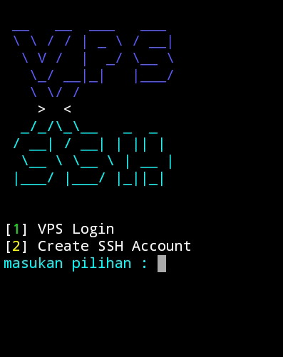
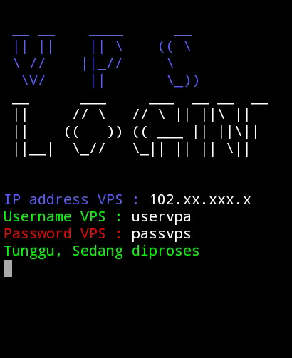
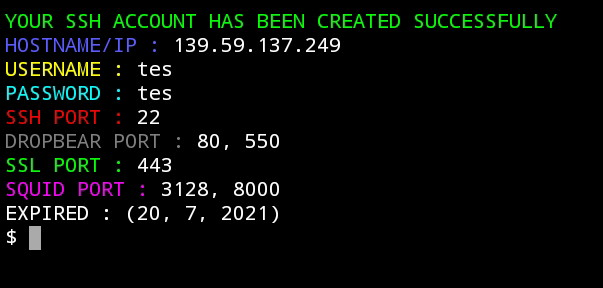

<b>PERHATIAN!!</b>

Script ini merupakan script untuk melakukan auto login vps, serta untuk membuat akun ssh

<table>
<thead>
<th colspan="2">module yang diperlukan</th>
</thead>
<tbody>
<tr>
<td>module python (pip install)</td>
<td>requests, tabulate, datetime</td>
</tr>
<tr>
<td>Module Tambahan (apt install)</td>
<td>openssh, sshpass</td>
</tr>
</tbody>
</table>

<b>SCREENSHOT SCRIPT</b>

</body>
</html>
